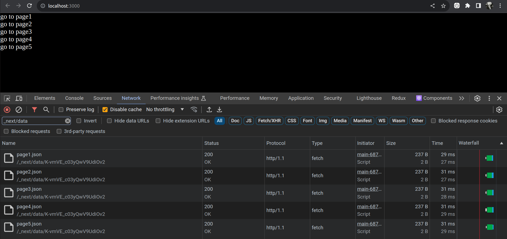
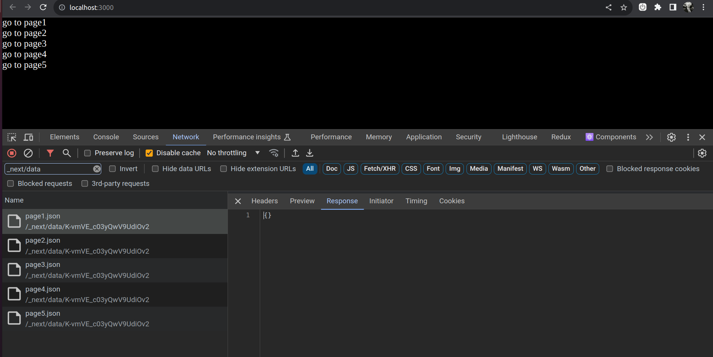

# Installation

1. Clone this repo
1. `npm install`
1. `npm run build`
1. `npm start`

# Steps to reproduce

1. Open your browser to `http://localhost:3000`
1. Open the devtools
1. Go to the network tab
1. Notice each additional `_next/data` request for each link to a page

1. Click on either of the request
1. Click on the `Response` tab
1. Notice the empty json response like this `{}`

